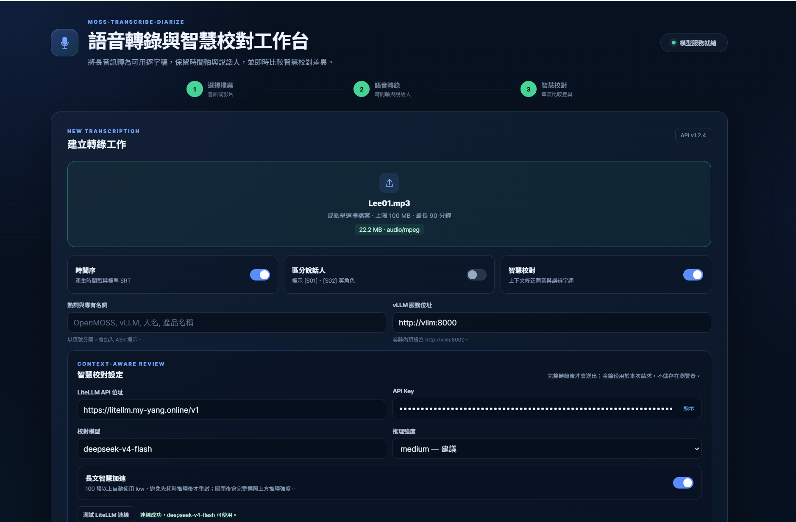

# MOSS-Transcribe-Diarize ASR 語音轉錄、多說話人分離與智慧校對系統

本專案針對 [OpenMOSS-Team/MOSS-Transcribe-Diarize](https://huggingface.co/OpenMOSS-Team/MOSS-Transcribe-Diarize) 開源端到端語音模型進行了深入研究與完整工程化實作。支援透過 **vLLM / SGLang** 部署服務，具備 **多格式音訊處理（MP3/WAV/M4A/MP4）**、**超長音訊自動靜音切片與時間戳對齊**、**時間序與說話人功能開關**、以及 **二階段文稿智慧校對（規則 + LLM 糾錯）**。

> **目前開發基準（2026-09-08）**：Docker API 映像為 `v14`，服務版本為 API `1.4.0`。本機完整服務使用 `127.0.0.1:17860`（Web UI/API）與 `127.0.0.1:18000`（vLLM），避免佔用常見的 7860 / 8000 對外埠。新增本機掛載式多語 Benchmark 頁面；詳細的模型選型與 Whisper 比較見[附錄](#9-附錄whisper-與-moss-transcribe-diarize-的-asr-比較)。

## Web UI 預覽



上圖為完整工作流：上傳音訊／影片後，可選擇時間戳、說話人標記、熱詞與 LiteLLM 智慧校對；完成後並排閱讀原始轉錄與校訂結果，下載 SRT／JSON，並逐段檢視修改差異。

## Docker Hub 快速使用

已發布兩個公開映像：

| 用途 | Image | 建議 tag |
| --- | --- | --- |
| GPU 模型服務（CUDA 13 / RTX 5090） | [`myyang0915/moss-transcribe-diarize-vllm`](https://hub.docker.com/r/myyang0915/moss-transcribe-diarize-vllm) | `cu130-vllm0.28.0` |
| 專案 Web UI 與 REST API | [`myyang0915/moss-transcribe-diarize-api`](https://hub.docker.com/r/myyang0915/moss-transcribe-diarize-api) | `v14` |

需要 Docker 的 NVIDIA GPU runtime，以及支援 CUDA 13 的 NVIDIA 驅動；不需要在 host 安裝 CUDA Toolkit。Windows 使用 Docker Desktop / WSL2 時，請保持 WSL 已更新。

### 一鍵使用完整服務

下載本專案的 [`compose.hub.yaml`](compose.hub.yaml)，在檔案所在資料夾執行：

```bash
docker compose -f compose.hub.yaml pull
docker compose -f compose.hub.yaml up -d
```

預設只開放本機連線：vLLM 是 `http://127.0.0.1:18000`，Web UI/API 是 `http://127.0.0.1:17860`。首次啟動會下載模型和進行 GPU compilation，可能需要數分鐘。此設定接受最大 **100 MiB** 的上傳檔，並允許解碼單一最長 **90 分鐘** 的音檔；128k context 適合單一超長請求，但 32 GB GPU 上超長請求的建議併發量是 1。

### 即時文字與 LiteLLM 串流校對

Web UI 預設使用 SSE 端點 `/api/transcribe/stream`：上傳完成後，MOSS/vLLM 產生的文字 token 會立刻顯示；ASR 完成後才會開始 LLM 校對，校對回覆也會串流顯示。畫面會同時保留原始轉錄、校對輸出，並在每個校對段落完成時以紅／綠標示逐段差異；最終結果會重新整理為可直接使用的 SRT。

`v8` 將 Web UI 拆分為獨立 HTML、CSS 與 JavaScript，不依賴外部 CDN；加入拖放上傳、服務就緒狀態、GPU 工作佇列、處理進度、行動裝置版面、只看已修改篩選，以及 API 層 100 MB 檔案驗證。未啟用智慧校對時不會再套用或誤標規則校對；LLM 失敗也會明確顯示為未完成。

`v9` 新增「測試 LiteLLM 連線」，可在轉錄前確認 API Key 是否有效，以及指定模型是否出現在該 Key 的可用模型清單。401／403 回應會顯示 LiteLLM 實際原因與權限提示，並自動遮蔽可能出現在回應中的 Key。

`v10` 修正 Cloudflare Browser Integrity Check 可能封鎖 Python `urllib` 預設指紋（Error 1010）的問題。LiteLLM 模型檢查與智慧校對請求現在都會帶入可設定的瀏覽器相容 User-Agent；如閘道需要指定值，可在 `.env` 透過 `LITELLM_USER_AGENT` 覆寫預設值。

`v11` 修正長文搭配推理模型時可能只產生 `reasoning_tokens`、最終內容為空而觸發 JSON 解析錯誤的問題。校對請求保留較充足的輸出額度；若首次只有推理內容，會自動降低推理強度重試，並提供可理解的診斷訊息。

`v12` 改善長文校對速度與等待體感：規則字典／標點初稿會先顯示；推理階段持續回報處理量、請求次數與重試狀態；模型開始輸出後逐段串流差異。預設開啟「長文智慧加速」，100 段以上會直接以 `low` 執行，避免 `medium/high` 先耗盡推理內容再重試；使用者可關閉此選項以完整遵照所選推理強度。

`v13` 依長文操作畫面調整繁體中文排版：提高全站輔助文字、表單、狀態與按鈕字級及對比，結果正文改用中文無襯線字體、加大行距與捲軸；差異卡片同步放大並強化新增／刪除色彩。結果區新增 `A− / A / A＋` 三段閱讀字級並記住使用者選擇；靜態資源帶有版本參數，避免瀏覽器繼續使用舊版 CSS／JavaScript。

`v14` 新增「多語 ASR Benchmark」頁面（`/benchmark`）：以主機掛載的本機音檔與 JSONL／CSV manifest 跑分，逐筆串流顯示參考逐字稿、轉錄輸出、WER／CER、正確率與 exact match；完成後提供依語言彙總與 JSON／CSV 下載。選擇 manifest 後可預覽樣本數、語言分布、參考逐字稿與原始音檔；完成跑分後也能在逐筆結果直接播放對應音檔。資料集一律唯讀掛載，測試音檔不會送往外部服務。資料集的 `en-US`、`zh-CN` 等 locale 會自動轉為 MOSS 支援的 `en`、`zh` 語言提示；無對應語言時改用模型自動偵測。混合 WER 與 CER 的多語 run 不會顯示不具意義的合併正確率，請以各語言列比較。

> **長文校對的已知行為**：ASR 結束後的智慧校對時間主要取決於外部 LiteLLM 模型，而非 MOSS 或 RTX 5090。對 100 段以上的逐字稿，本專案會在「長文智慧加速」開啟時將 `medium/high` 降為 `low`。若所選推理模型持續輸出 reasoning 而尚未輸出 JSON，畫面會顯示已處理的推理字元；建議優先選擇 `none`、`minimal` 或 `low` 取得較低等待時間，並保留規則初稿作為即時可讀結果。

校對預設會連至 `https://litellm.my-yang.online/v1` 的 `deepseek-v4-flash`。提示詞會優先辨識有上下文支持的中文同音／近音 ASR 錯字、常用詞誤辨與臺灣慣用語；英文空格與標點僅是低優先的排版修正。請在 Web UI 的密碼欄位輸入金鑰，或在未提交的 `.env` 設定 `LITELLM_API_KEY`；不要把真實金鑰放入 `compose*.yaml`、README 或版本控制。介面可選擇 `none`、`minimal`、`low`、`medium`、`high` 的 `reasoning_effort`。

此為「完整檔案上傳後的輸出串流」，不是邊錄音邊送音訊的 realtime ASR；MOSS 模型會先取得完整上傳音訊，再開始回傳文字 token。

### 只啟動 OpenAI 相容轉錄 API

```bash
docker run --rm --gpus all --ipc=host \
  -p 8000:8000 \
  -e VLLM_WSL2_ENABLE_PIN_MEMORY=1 \
  -v moss-hf-cache:/root/.cache/huggingface \
  -v moss-vllm-cache:/root/.cache/vllm \
  myyang0915/moss-transcribe-diarize-vllm:cu130-vllm0.28.0 \
  OpenMOSS-Team/MOSS-Transcribe-Diarize \
  --trust-remote-code --host 0.0.0.0 --port 8000 \
  --dtype bfloat16 --gpu-memory-utilization 0.80 --max-model-len 131072
```

測試轉錄：

```bash
curl http://127.0.0.1:8000/v1/audio/transcriptions \
  -F model=OpenMOSS-Team/MOSS-Transcribe-Diarize \
  -F file=@audio.wav \
  -F response_format=json \
  -F temperature=0
```

不要將 8000 / 18000 或 7860 / 17860 直接公開到 Internet；vLLM OpenAI 相容 API 預設沒有身分驗證。若需要遠端使用，請放在具認證的 reverse proxy 後方。

---

## 📑 目錄

1. [MOSS-Transcribe-Diarize 模型深度研究](#1-moss-transcribe-diarize-模型深度研究)
2. [vLLM 服務部署指南](#2-vllm-服務部署指南)
3. [多媒體格式支援與自動裁切分段機制](#3-多媒體格式支援與自動裁切分段機制)
4. [功能開關：時間序與說話人分離](#4-功能開關時間序與說話人分離)
5. [文稿智慧校對與錯誤減少模組](#5-文稿智慧校對與錯誤減少模組)
6. [架構與模組設計](#6-架構與模組設計)
7. [快速開始與使用指南](#7-快速開始與使用指南)
   - [CLI 命令列工具](#cli-命令列工具)
   - [Python SDK API](#python-sdk-api)
   - [Web UI 與 REST API 服務](#web-ui-與-rest-api-服務)
   - [多語 ASR Benchmark](#75-多語-asr-benchmark)
8. [單元測試驗證](#8-單元測試驗證)
9. [附錄：Whisper 與 MOSS-Transcribe-Diarize 的 ASR 比較](#9-附錄whisper-與-moss-transcribe-diarize-的-asr-比較)

---

## 1. MOSS-Transcribe-Diarize 模型深度研究

`OpenMOSS-Team/MOSS-Transcribe-Diarize` 是復旦大學 OpenMOSS 團隊與上海創新研究院（SII）於 2026 年發布的 0.9B 端到端語音理解大模型，並在 INTERSPEECH 2026 **第二屆 MLC-SLM Challenge** 奪得第一名。

### 核心特性與優勢

| 特性 | 傳統 ASR + Diarization 方案 | MOSS-Transcribe-Diarize 0.9B |
| :--- | :--- | :--- |
| **架構設計** | 語音辨識模型 + 聲紋聚類（PyAnnote/VAD）拼裝 | **端到端聯合建模**，單次前向生成轉錄、時間戳與角色 |
| **重疊說話** | 難以處理多人重疊與插話 | 透過 Contextual Attention 原生處理多人搶話與插話 |
| **模型規模** | 多個模型組合（佔用顯存大、延遲高） | 僅 **0.9B** 參數量（Qwen3-0.6B + Whisper-Medium） |
| **長音訊支援** | 需手動切短句（易切斷詞句） | 支援 **128k 上下文**，單次最長可轉錄 **90 分鐘** |
| **輸出格式** | 各模組時間軸難以精確對齊 | 緊湊標準格式：`[start][Sxx]text[end]` |
| **多語言支援** | 依賴各語言專用模型 | 支援 **50+** 種語言聯合轉錄與分離 |

### 模型架構規格

```
[原始音訊 (16kHz Mono)] 
       │
       ▼
[Whisper-Medium 音訊編碼器 (80 Mel-bins, 30s 分塊)]
       │
       ▼
[4x 時間維度降採樣 (Temporal Merge) + MLP 投影適配層]
       │
       ▼ (替換 <|audio_pad|> Embedding)
[Qwen3-0.6B Causal Decoder (128k Context)]
       │
       ▼
[標準輸出序列: [0.48][S01]歡迎大家...[2.35][3.10][S02]好的...[5.20]]
```

---

## 2. vLLM 服務部署指南

MOSS-Transcribe-Diarize 原生支援透過 vLLM 暴露相容 OpenAI 的 `/v1/audio/transcriptions` 接口。

### 2.1 環境安裝

依據您的 CUDA 版本安裝對應支援 MOSS 的固定版 vLLM：

```bash
# CUDA 12 環境:
uv pip install -U vllm \
  --torch-backend=auto \
  --extra-index-url https://wheels.vllm.ai/68b4a1d582818e67adc903bf1b8fc5a5447da2fa/cu129

# CUDA 13 環境:
uv pip install -U vllm \
  --torch-backend=auto \
  --extra-index-url https://wheels.vllm.ai/68b4a1d582818e67adc903bf1b8fc5a5447da2fa/cu130
```

### 2.2 啟動服務

使用本專案提供的快速啟動腳本 [vllm_serve.sh](vllm_serve.sh)：

```bash
./vllm_serve.sh
```

或手動執行：

```bash
vllm serve OpenMOSS-Team/MOSS-Transcribe-Diarize \
  --host 0.0.0.0 \
  --port 8000 \
  --trust-remote-code \
  --gpu-memory-utilization 0.90 \
  --max-model-len 131072 \
  --dtype bfloat16
```

> **備註（SGLang Omni 替代方案）**：
> 若在 CUDA 13 環境亦可使用 SGLang Omni 部署：
> `sgl-omni serve --model-path OpenMOSS-Team/MOSS-Transcribe-Diarize --port 8000 --max-running-requests 16 --mem-fraction-static 0.80`

---

## 3. 多媒體格式支援與自動裁切分段機制

本系統內建完整 [AudioProcessor](moss_asr/audio_processor.py)：

### 3.1 格式支援
- **音訊格式**：`.mp3`, `.wav`, `.m4a`, `.aac`, `.flac`, `.ogg`
- **影片格式**：`.mp4`, `.mkv`, `.mov`, `.webm`, `.avi`, `.flv`
- 自動透過 FFmpeg 探測音訊串流並轉碼為標準 16kHz 16-bit Mono PCM WAV。

### 3.2 超長音訊智慧自動裁切（Auto-Chunking & Silence Slicing）
當音訊時長超過設定上限（預設 1800 秒 / 30 分鐘，可透過 `--max-chunk-sec` 自定義）：
1. **靜音偵測切片**：利用 FFmpeg `silencedetect` 演算法，在預期切片點附近（±30 秒內）尋找自然停頓或換氣點，**避免在說話中途生硬切斷字詞**。
2. **重疊兜底**：若無檢測到靜音點，則採用平滑 Overlap 視窗切片。
3. **精確時間戳累加與對齊**：每個分段轉錄完成後，自動將分段起始偏移 `start_offset` 補回所有時間戳，確保多個分段合併後的 SRT/VTT/逐字稿時間軸絕對精確。

---

## 4. 功能開關：時間序與說話人分離

系統支援透過參數動態生成對應 Prompt 並過濾解析結果：

| 功能組合 | 參數設定 | 適用場景 |
| :--- | :--- | :--- |
| **完整模式 (預設)** | `--timestamps --diarize` | 會議紀錄、字幕壓制、法庭訪談（帶時間與 [S01]/[S02]） |
| **純說話人模式** | `--no-timestamps --diarize` | 劇本、訪談對話逐字稿（保留發言者，去除時間） |
| **純時間戳模式** | `--timestamps --no-diarize` | 單人演講、Podcast 字幕（僅保留時間軸） |
| **純文字模式** | `--no-timestamps --no-diarize` | 文章閱讀、純內容轉錄（乾淨流暢段落） |

### 熱詞增強（Hotwords Prompting）
支援注入領域術語（例如 `--hotwords "OpenMOSS,vLLM,Transformer,PyTorch"`），模型會在轉錄時優先辨識指定詞彙，顯著降低專有名詞錯誤率。

### 說話人自定義對稱（Speaker Name Mapping）
支援傳入 JSON 說話人對照表（例如 `{"S01": "張經理", "S02": "李工程師"}`），輸出自動替換代號為真實姓名。

---

## 5. 文稿智慧校對與錯誤減少模組

針對語音轉錄常見的錯字、贅詞問題，本專案建構了 **二階段文稿校對管線 (TranscriptProofreadingPipeline)**：

```
[原始 ASR 轉錄結果]
       │
       ▼
【第一階段：規則與字典校對器 (RuleBasedProofreader)】
  ├─ 1. 同音/音近錯別字映射 (如「佈署」->「部署」、「因該」->「應該」)
  ├─ 2. 口吃與連續重複字清理 (如「我、我、我們」->「我們」、「那個那個」->「那個」)
  ├─ 3. 標點符號標準化 (消除連點、修正中英文間距、補齊句末標點)
  └─ 4. 使用者自定義專業詞庫置換
       │
       ▼
【第二階段：LLM 語義智慧校對器 (LLMProofreader)】(可選開關)
  ├─ 接入 OpenAI / Qwen / DeepSeek / 本地 LLM
  ├─ 根據上下文語意自動修正諧音誤聽、修復語法斷句
  └─ 嚴格保持發言者標籤與時間戳結構不變
       │
       ▼
[高品質無瑕疵逐字稿 & SRT / JSON / TXT]
```

---

## 6. 架構與模組設計

```
/home/ubuntu/workspaces/asr/
├── moss_asr/
│   ├── config.py              # 配置資料類別 (ASRConfig, AudioChunkConfig, ProofreadConfig)
│   ├── audio_processor.py     # 多格式轉換 (FFmpeg) 與靜音切片引擎
│   ├── prompt_builder.py      # 動態 Prompt 建構器 (時間/人員/熱詞)
│   ├── transcript_parser.py   # 高效字串解析與結構化 TranscriptSegment
│   ├── vllm_client.py         # vLLM / SGLang OpenAI API 客戶端
│   ├── transformers_engine.py # 本地 Transformers 推理引擎
│   ├── proofreader.py         # 規則與 LLM 智慧校對引擎
│   ├── exporter.py            # 多格式輸出 (TXT, MD, SRT, VTT, JSON, CSV)
│   └── pipeline.py            # 主調度管線 (MossASRPipeline)
├── cli.py                     # CLI 命令列介面
├── app_api.py                 # FastAPI REST API 與 Web UI 伺服器
├── web/
│   ├── index.html             # 獨立、無 CDN 的 Web UI 結構
│   ├── styles.css             # 響應式產品介面樣式
│   └── app.js                 # SSE、逐段差異與下載互動
├── vllm_serve.sh              # vLLM 一鍵部署腳本
├── tests/                     # 完整單元測試 (pytest)
└── requirements.txt           # 相依套件清單
```

---

## 7. 快速開始與使用指南

### 7.1 安裝依賴

```bash
cd /home/ubuntu/workspaces/asr
pip install -r requirements.txt
```

### 7.2 CLI 命令列工具

#### 基本轉錄（預設開啟時間序與說話人）：
```bash
python3 cli.py -i meeting.mp3 -o ./output
```

#### 關閉時間序，僅保留說話人：
```bash
python3 cli.py -i meeting.m4a --no-timestamps --diarize -o ./output
```

#### 加入專有熱詞與說話人姓名映射：
```bash
python3 cli.py -i interview.mp4 \
  --hotwords "OpenMOSS,vLLM,人工智慧" \
  --speaker-map '{"S01": "張主持人", "S02": "李專家"}' \
  -o ./output
```

#### 啟用 LLM 智慧文稿校對：
```bash
python3 cli.py -i lecture.wav \
  --proofread \
  --llm-url https://api.openai.com/v1 \
  --llm-key "sk-..." \
  --llm-model gpt-4o-mini \
  -o ./output
```

---

### 7.3 Python SDK API

```python
from moss_asr import (
    PipelineConfig,
    ASRConfig,
    AudioChunkConfig,
    ProofreadConfig,
    MossASRPipeline,
    TranscriptExporter,
)

# 1. 初始化配置
config = PipelineConfig(
    audio=AudioChunkConfig(max_duration_seconds=1800.0),
    asr=ASRConfig(
        vllm_base_url="http://localhost:8000",
        include_timestamps=True,
        include_speakers=True,
        hotwords=["OpenMOSS", "vLLM"],
        speaker_names={"S01": "張經理", "S02": "王工程師"},
    ),
    proofread=ProofreadConfig(
        enabled=True,
        llm_api_base="https://api.openai.com/v1",
        llm_api_key="sk-...",
        llm_model="gpt-4o-mini",
        remove_stutter=True,
    ),
)

# 2. 建立管線並執行轉錄
pipeline = MossASRPipeline(config)
result = pipeline.process("meeting.mp4")

# 3. 取得多種格式輸出
print("=== 純文字逐字稿 ===")
print(TranscriptExporter.to_txt(result))

print("=== SRT 字幕 ===")
print(TranscriptExporter.to_srt(result))

# 4. 一鍵儲存所有檔案 (.txt, .md, .srt, .vtt, .json, .csv)
pipeline.process_and_export("meeting.mp4", output_dir="./results")
```

---

### 7.4 Web UI 與 REST API 服務

啟動互動式網頁與 API 伺服器：

```bash
python3 app_api.py
```

- 直接執行時預設開啟：`http://localhost:7860`（可用 `MOSS_API_PORT` 覆寫）。使用本 README 的 Docker Compose 則開啟：`http://127.0.0.1:17860`。
- 可直接在網頁上傳音訊/影片、勾選時間序/說話人/校對開關、設定熱詞並直接預覽與下載 SRT/JSON。

### 7.5 多語 ASR Benchmark

開啟 `http://127.0.0.1:17860/benchmark` 後，可選擇已掛載的資料集、指定語言提示與評分方式，系統會依序使用同一個 MOSS/vLLM 設定轉錄，並即時計算：

- **WER**：以詞為單位，適用英文與多數以空格分詞的語言。
- **CER**：以字元為單位，預設用於中文、日文、韓文、泰文等無可靠空格分詞的語言。
- **正確率**：`max(0, 100% − 錯誤率)`；另顯示整句完全一致的 exact match 比例。

資料集不經瀏覽器上傳。Docker Compose 會將主機的 `./benchmarks` 唯讀掛載為容器中的 `/benchmarks`。請在該資料夾建立每個資料集的目錄與 manifest；詳細格式見 [benchmarks/README.md](benchmarks/README.md)，可從 [manifest.example.jsonl](benchmarks/manifest.example.jsonl) 開始。實際 benchmark 音檔與 manifest 已排除於 Git 與 Docker build context，避免將受授權限制或私人音檔意外發布：

```text
benchmarks/
└── fleurs-zh-tw-dev/
    ├── test.jsonl
    └── audio/
        ├── 0001.wav
        └── 0002.wav
```

```json
{"id":"zh-0001","audio":"audio/0001.wav","text":"這是一段參考逐字稿。","language":"zh-TW"}
```

建議先以 20 筆驗證流程，再提高到完整 split。可使用下列公開資料來源並自行下載需要的語言／split：

- [Mozilla Common Voice](https://commonvoice.mozilla.org/datasets)：CC0、多口音、100+ 語言，適合一般語音與繁中／台語覆蓋。
- [Google FLEURS](https://huggingface.co/datasets/google/fleurs)：CC BY 4.0、102 語言，適合固定跨語基準。
- [VoxPopuli](https://huggingface.co/datasets/facebook/voxpopuli)：18 種歐洲語言與多種英語口音；適合演講／議會型語料。
- [MInDS-14](https://huggingface.co/datasets/PolyAI/minds14)：CC BY 4.0、14 種語言的客服／銀行語音，適合短句多語冒煙測試。
- [LibriSpeech ASR](https://huggingface.co/datasets/openslr/librispeech_asr)：CC BY 4.0、英文朗讀語音，適合作為英文基準對照。
- [ML-SUPERB 2.0](https://multilingual.superbbenchmark.org/challenge-interspeech2025/data_description)：141 語言開發集；授權依原始來源資料而定。

請保留資料集原始授權、引用與隱私條款；Benchmark 用來比較系統時，應固定測試 split、正規化方式、語言提示與解碼參數。

---

## 8. 單元測試驗證

本專案目前有 51 項 Python 自動化測試，另有前端串流／逐段差異解析測試；涵蓋音訊切片、解析器、提示詞建構、校對引擎、格式匯出、API 輸入驗證，以及 benchmark manifest／WER／CER、locale 語言提示、跨指標防誤合併、安全音檔播放與逐筆 SSE 跑分：

```bash
python3 -m pytest tests/
```

```text
============================== 51 passed ==============================
```

---

## 9. 附錄：Whisper 與 MOSS-Transcribe-Diarize 的 ASR 比較

本節以 [Hugging Face Open ASR Leaderboard](https://huggingface.co/spaces/hf-audio/open_asr_leaderboard) 中兩個模型卡所列的公開結果為基礎，並補充模型設計與部署層面的差異。數值是同一排行榜的快照，適合用來觀察公開基準上的趨勢；**不能直接視為繁體中文、特定麥克風、特定領域或本機 RTX 5090 的實測承諾**。

### 9.1 可比的公開 ASR 指標

| 模型 | Mean WER ↓ | AMI WER ↓ | RTFx ↑ | 解讀 |
| --- | ---: | ---: | ---: | --- |
| [MOSS-Transcribe-Diarize 0.9B](https://huggingface.co/OpenMOSS-Team/MOSS-Transcribe-Diarize) | **5.17** | **8.40** | **294.02** | 端到端轉錄、說話人標記與時間戳。 |
| [Whisper large-v3](https://huggingface.co/openai/whisper-large-v3) | 7.44 | 15.95 | 145.51 | 通用多語 ASR／語音翻譯模型；說話人分離需外接管線。 |
| [Whisper large-v3-turbo](https://huggingface.co/openai/whisper-large-v3-turbo) | 7.83 | 16.13 | 200.19 | large-v3 的裁剪解碼器版本，速度較快但品質略降。 |

在上述排行榜快照中，MOSS 相對 Whisper large-v3 的 Mean WER 低 **2.27 個百分點**（約 **30.5% 相對錯誤下降**），AMI WER 低 **7.55 個百分點**。RTFx 則是公開評測環境中的吞吐指標，MOSS 約為 large-v3 的 2 倍；實際速度仍會受到推論後端、解碼設定、音訊長度、批次與 GPU 影響，不能套用為本機絕對速度。

### 9.2 能力與工程取捨

| 面向 | MOSS-Transcribe-Diarize 0.9B | Whisper large-v3 / large-v3-turbo |
| --- | --- | --- |
| 核心定位 | 長音訊、多說話人的端到端轉錄。 | 通用零樣本多語 ASR；large-v3 同時支援語音轉英文。 |
| 參數量 | 0.9B；以 Whisper-Medium 音訊編碼器搭配 Qwen3-0.6B 解碼器。 | large-v3 為 1.55B；turbo 由 large-v3 裁剪解碼層以換取速度。 |
| 語言覆蓋 | 官方標示 50+ 種語言。 | 官方模型卡標示 99 種語言。 |
| 時間戳 | 原生輸出起訖時間戳。 | 可輸出時間戳，但長音檔通常以連續／分塊解碼處理。 |
| 說話人分離 | 原生輸出匿名 `[S01]`、`[S02]` 等角色標記。 | Whisper 本體不產生說話人身份；實務上會串接 VAD、對齊與 diarization 工具，例如 [WhisperX](https://arxiv.org/abs/2303.00747)。 |
| 長音訊 | 官方標示可單次推論最長 90 分鐘；本專案再以靜音切片保護長檔。 | 可處理任意長度輸入，但需依賴滑動視窗／分塊與解碼啟發式策略。 |
| 本專案適配度 | 最適合會議、訪談、課程與要產出多說話人 SRT 的流程。 | 適合只需要高成熟度純 ASR、語音翻譯、99 語言覆蓋，或既有 Whisper 生態系整合的情境。 |

Whisper 的優勢是成熟、可移植的 ASR 生態與廣泛語言支援；OpenAI 的原始研究也顯示其零樣本跨資料集魯棒性很強。然而 Whisper 的模型卡同時提醒，弱監督訓練可能導致音訊中未說出的內容被模型幻覺式補出，因此關鍵逐字稿仍應建立領域測試集與人工抽查流程。

MOSS 的優勢是將「逐字稿、時間戳、說話人歸屬」放在一次端到端輸出中，降低多模型串接時的對齊與角色對應成本。其 `[Sxx]` 是單一音檔內的相對匿名角色，**不是可跨錄音辨識真人身份的聲紋 ID**。

### 9.3 本專案的選型結論與驗證建議

本專案目前以 MOSS 為預設，原因是目標工作流需要長音訊、中文語境、時間序、多人標記與可直接下載 SRT；這些都是 MOSS 的原生輸出。若主要需求改為跨語語音翻譯、極廣語言覆蓋，或既有服務已深度採用 Whisper／WhisperX，Whisper large-v3 或 large-v3-turbo 值得作為替代基線。

正式選型前，建議以同一批內部錄音做 A/B 測試，而不是只依排行榜決定：繁體中文以 CER 為主、英文以 WER 為主；多人會議另測 cpCER／DER、說話人輪替正確性、時間戳偏差、長音檔重複／漏字率、RTF 與 GPU 記憶體。測試資料應至少包含會議、課程、訪談、背景噪音、多人插話，以及含大量專有名詞的錄音。

### 9.4 來源與版本註記

- [MOSS-Transcribe-Diarize 官方模型卡](https://huggingface.co/OpenMOSS-Team/MOSS-Transcribe-Diarize)：功能、90 分鐘單次推論、模型規模及 Open ASR Leaderboard 指標。
- [OpenMOSS 官方儲存庫](https://github.com/OpenMOSS/MOSS-Transcribe-Diarize)：輸出格式、客觀評測與部署說明。
- [Whisper large-v3 官方模型卡](https://huggingface.co/openai/whisper-large-v3)：模型規模、99 語言、訓練資料、限制與 Open ASR Leaderboard 指標。
- [Whisper large-v3-turbo 官方模型卡](https://huggingface.co/openai/whisper-large-v3-turbo)：裁剪解碼器與速度／品質取捨。
- [Whisper 原始論文](https://arxiv.org/abs/2212.04356) 與 [WhisperX 論文](https://arxiv.org/abs/2303.00747)：長音檔解碼策略與外接對齊／diarization 背景。
